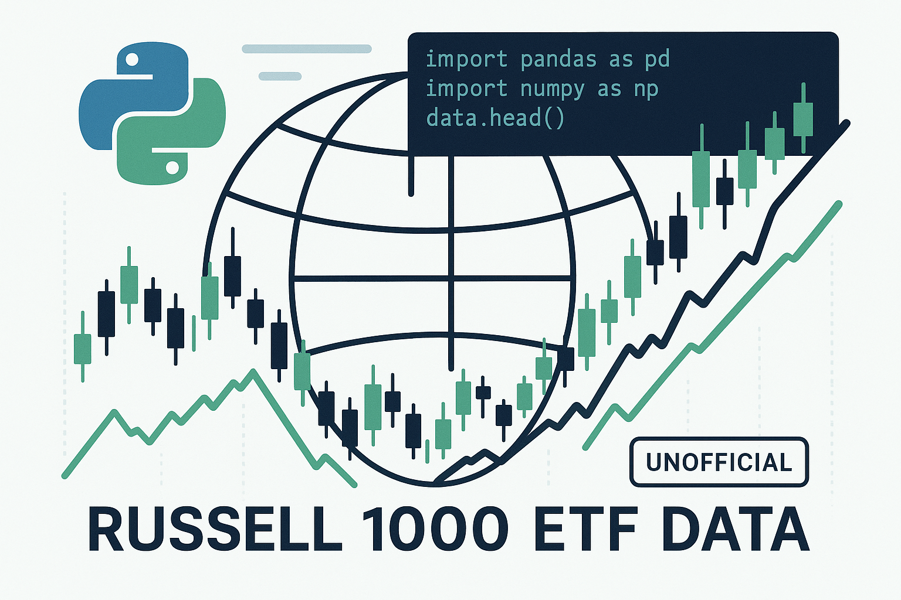

<div align="center">
  
</div>

# iShares ETF Data Retriever (`ishares-etf-data`)

This Python library provides a simple interface to fetch holding data for the iShares Russell 1000 ETF from the iShares website.

## DISCLAIMER

**IMPORTANT LEGAL NOTICE: PLEASE READ CAREFULLY**

This software package ("ishares-etf-data") is an **UNOFFICIAL** tool that is not affiliated with, endorsed by, sponsored by, or in any way officially connected with BlackRock, iShares, or any of their subsidiaries or affiliates.

The author(s) of this package:
1. DISCLAIM ALL WARRANTIES, EXPRESS OR IMPLIED, including without limitation, any warranties of merchantability, fitness for a particular purpose, or non-infringement.
2. ASSUME NO LIABILITY OR RESPONSIBILITY for any damages, losses, or other harm that may result from using this software.
3. PROVIDE THIS SOFTWARE "AS IS" AND "AS AVAILABLE" without any guarantees regarding its accuracy, reliability, or availability.

This package accesses publicly available data through web scraping and API calls. Users of this package are solely responsible for:
- Ensuring their use complies with iShares' Terms of Service and applicable laws
- Respecting rate limits and robot exclusion standards
- Any consequences that may arise from the use of this package

This package is intended for educational and informational purposes only. Any financial decisions made based on data retrieved through this package are made at the user's own risk.

By using this package, you acknowledge that you have read and understood this disclaimer.

## How It Works

The library interacts with multiple iShares API endpoints and web pages to retrieve holdings data for the Russell 1000 ETF:

1. **Data Sources**:
   - JSON API endpoints for regular holdings data
   - HTML parsing of the main product page to extract the most current available date
   - Multiple endpoints to ensure the most up-to-date information

2. **Core Functionality**:
   - Fetches available holding dates from the distributions API endpoint
   - Retrieves detailed holdings data for specific dates
   - Extracts ticker symbols, sectors, asset classes, and weights
   - Implements sorting and filtering capabilities for analysis

3. **Technical Implementation**:
   - Uses the `requests` library for API communication
   - Includes caching to minimize redundant API calls
   - Implements robust error handling for network and data format issues
   - Provides flexible date format handling (input and output)

The library is designed to handle real-world issues like date unavailability and ensures you always get the most recent data, even when it's not immediately accessible through standard API endpoints.

## Features

*   Fetch a list of available dates for which holdings data is published
*   Fetch detailed holdings data for a specific date
*   Data is returned in a structured `HoldingData` class that provides:
    *   Access to raw holding data from the API
    *   List of all tickers and sectors
    *   Detailed information for each holding with consistent structure
    *   Lookup holdings by ticker symbol
    *   Filter holdings by sector
    *   Calculate sector weights and market values
*   Built-in caching to improve performance for repeated requests
*   Robust error handling with specific exception types
*   Configurable request timeouts

## Installation

1.  **Clone the repository (or download the source code):**
    ```bash
    git clone https://github.com/0rshemesh/ishares_etf_data.git
    cd ishares_etf_data
    ```

2.  **Install the library:**
    It's recommended to install in a virtual environment.
    ```bash
    python -m venv venv
    source venv/bin/activate  # On Windows: venv\Scripts\activate
    
    pip install .
    ```
    This will install the package along with its dependency (`requests`) as specified in `pyproject.toml` and `setup.py`.

    Alternatively, for development, you can install it in editable mode:
    ```bash
    pip install -e .
    ```

## Basic Usage

```python
from ishares_etf_data import get_available_holding_dates, get_holdings, HoldingData, clear_cache

# Get available holding dates (results are cached)
try:
    available_dates = get_available_holding_dates()
    if not available_dates:
        print("No available dates found.")
        exit()
    
    print(f"Available dates (most recent first, showing up to 5): {available_dates[:5]}")
    
    # Select a date (e.g., the most recent one)
    target_date = available_dates[0]
    
    # Fetch holdings for the selected date
    holdings_data = get_holdings(target_date)

    print(f"Successfully fetched data for: {holdings_data.date}")
    print(f"Total holdings: {len(holdings_data)}")  # Using __len__

    # Get all tickers
    all_tickers = holdings_data.tickers
    if all_tickers:
        print(f"First 5 tickers: {all_tickers[:5]}")

        # Get details for a specific ticker (cached lookup)
        sample_ticker = all_tickers[0]
        ticker_details = holdings_data.get_holding_by_ticker(sample_ticker)
        if ticker_details:
            print(f"\nDetails for {sample_ticker}:")
            print(f"  Name: {ticker_details.get('name')}")
            print(f"  Sector: {ticker_details.get('sector')}")
            print(f"  Weight: {ticker_details.get('weight')}")

except Exception as e:
    print(f"An error occurred: {e}")
```

## Advanced Features

### Error Handling

The library provides specific exception types to help you handle errors:

```python
from ishares_etf_data import get_holdings, NetworkError, DataFormatError, InvalidDateError

try:
    holdings = get_holdings("20240101")
except InvalidDateError as e:
    print(f"Invalid date format: {e}")
except NetworkError as e:
    print(f"Network error: {e}")
except DataFormatError as e:
    print(f"Data format error: {e}")
```

### Working with Sectors

```python
# Get all unique sectors
sectors = holdings_data.sectors
print(f"Available sectors: {sectors}")

# Filter holdings by sector
technology_holdings = holdings_data.filter_by_sector("Technology")
print(f"Number of technology holdings: {len(technology_holdings)}")

# Get sector weights
sector_weights = holdings_data.get_sector_weights()
for sector, weight in sorted(sector_weights.items(), key=lambda x: x[1], reverse=True)[:5]:
    print(f"{sector}: {weight:.2f}%")
```

### Caching and Timeouts

The library caches results to improve performance for repeated calls:

```python
# First call fetches from network
dates = get_available_holding_dates()

# Second call uses cached result
dates_again = get_available_holding_dates()  # Much faster

# Clear the cache if you need fresh data
clear_cache()

# Specify a custom timeout (in seconds)
dates = get_available_holding_dates(timeout=30)
holdings = get_holdings("20240101", timeout=30)
```

## Data Structure

Each holding item in `HoldingData.holdings` is a dictionary with the following structure:

```python
{
    'ticker': str,          # Ticker symbol
    'name': str,            # Name of the holding
    'sector': str,          # Sector classification
    'asset_class': str,     # Asset class
    'market_value': Any,    # Market value (raw numeric, could be int or float)
    'weight': Any,          # Weight in the ETF (raw numeric)
    'notional_value': Any,  # Notional value (raw numeric)
    'shares': Any,          # Number of shares (raw numeric)
    'cusip': str,           # CUSIP identifier
    'isin': str,            # ISIN identifier
    'sedol': str,           # SEDOL identifier
    'price': Any,           # Price (raw numeric)
    'location': str,        # Location/Country
    'exchange': str,        # Exchange where traded
    'currency': str,        # Currency of the holding
    'fx_rate': Any,         # FX rate (often a string like "1.00" or a number)
    'maturity': str         # Maturity date (if applicable, e.g., for bonds/futures)
}
```
Note: Fields like `market_value`, `weight`, etc., are `Any` because the raw value could be an `int` or `float` depending on the API response. Appropriate type conversion might be needed by the user if a specific numeric type is always expected.

## Development

To set up for development:

1.  Clone the repository.
2.  Create and activate a virtual environment.
3.  Install in editable mode: `pip install -e .[dev]` (if you add a `[dev]` extra in `pyproject.toml` for linters/testers).
    Or simply `pip install -e .`

## Notes

*   The data is fetched directly from iShares public URLs. Availability and format may change without notice.
*   The library includes error handling for network issues and unexpected data formats.
*   To configure logging, you can use Python's standard logging library:
    ```python
    import logging
    logging.basicConfig(level=logging.INFO)
    ``` 

## Acknowledgments

This project was assisted and co-written by Vibe Coding. 